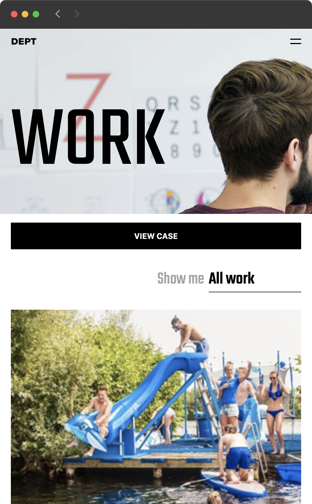
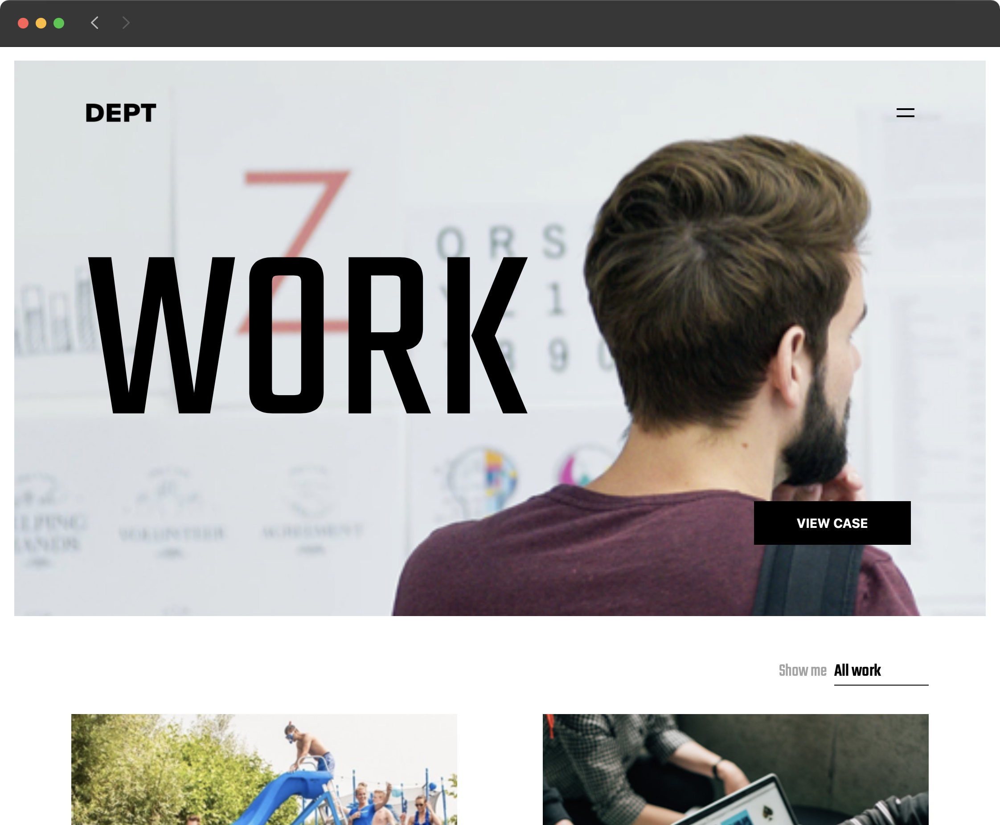

<h1 align='center'>Assignment DEPT Agency</h1>
<p align="center">
	
	
	<h5 align="center">INTRO</h5>
	<p align="center">
	For my second interview with Dept Agency, I had to make a technical assignment to test my knowledge. It is a responsive web page made with React.
	</p>
</p>
<br>


## Getting started
This project is made with React. It uses different scripts to speed up the process. Open [http://localhost:3000](http://localhost:3000) to view it in the browser.

```shell
# Clone repository
git clone https://github.com/peppequint/dept-assignment.git

# Go to the repository
cd dept-assignment

# Install dependencies
npm install

# Runs the app in the development mode
npm start
```

This project uses a fake REST API server which can be deployed as following. This is necessary to let the project work properly.

``` shell
# Run Express server
npm run mock-api
```

Builds the app for production to the build folder.
``` shell
# Run build
npm run build
```
